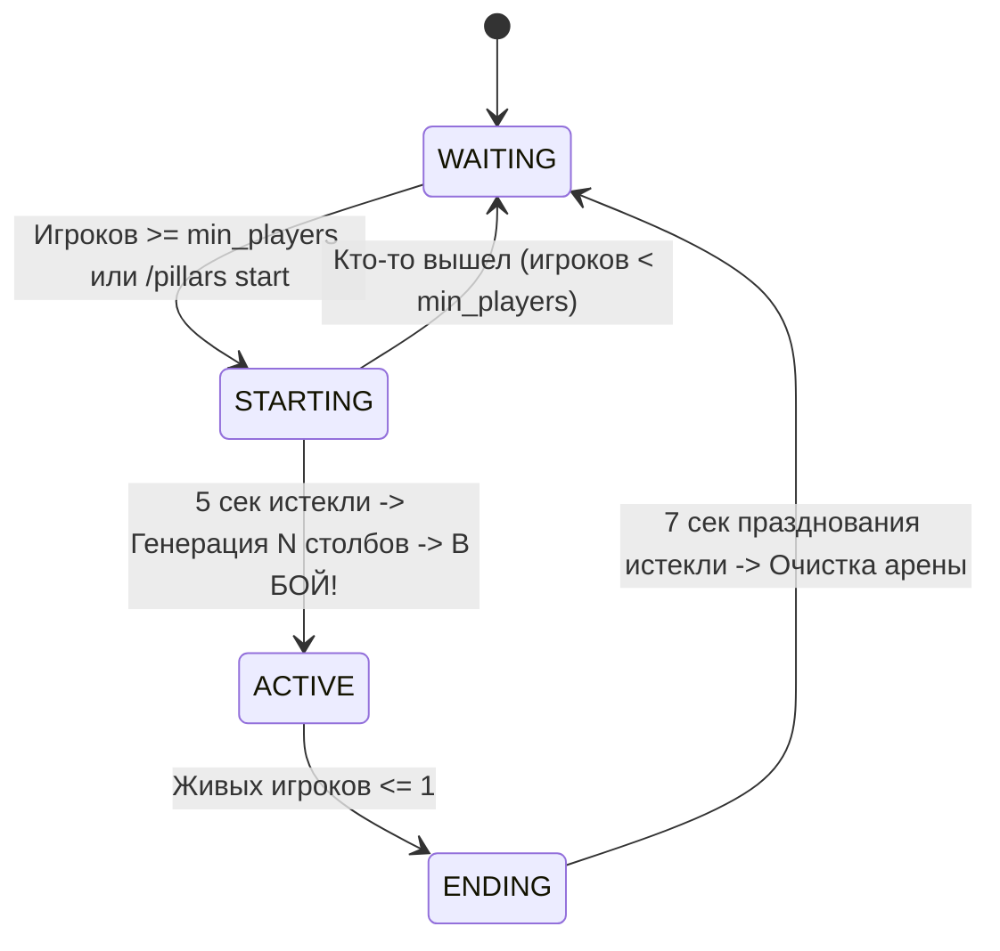

# Architecture: Pillars of Fortune

## 1. Топология пакетов
```
space.nadamu.nadamupillar/
├── PillarsPlugin.java              # Главный класс Bukkit-плагина
├── api/                            # Кастомные события (PlayerEliminateEvent)
├── domain/                         # Доменные модели (GamePlayer, PlayerRole)
├── registry/                       # Реестры участников (PlayerRegistry)
├── fsm/                            # Конечно-автоматный жизненный цикл игры
│   ├── GameState.java              # Интерфейс состояния
│   ├── GameManager.java            # Оркестратор состояний и тиков
│   ├── WaitingState.java           # Состояние ожидания (спектаторы над центром)
│   ├── StartingState.java          # Отсчет 5 секунд
│   ├── ActiveState.java            # Генерация N столбов и фаза битвы
│   └── EndingState.java            # Финал и чествование на руинах (7 сек)
├── arena/                          # Процедурная генерация арен CubeCraft и FAWE
│   ├── ArenaService.java           # Базовый контракт арены
│   ├── ProceduralArenaService.java # Процедурный генератор N столбов + центр
│   └── model/                      # Модели конфигурации карт и паттернов
├── loot/                           # Механика взвешенного лута
│   ├── WeightedLootTable.java      # Префиксные суммы O(log N)
│   └── LootService.java            # Сервис раздачи лута
├── disaster/                       # Движок катастроф
│   ├── Disaster.java               # Интерфейс катастрофы
│   └── DisasterService.java        # Планировщик катастроф
└── listener/                       # Bukkit-слушатели (один раз в onEnable)
    ├── VoidTrackingListener.java   # Перехват бездны и смертельного урона
    ├── PlayerConnectionListener.java # Обработка входа/выхода
    └── GameProtectionListener.java # Блокировка PvP/строительства по стейту
```

## 2. Жизненный цикл FSM


## 3. Одномировая архитектура (Single World)
Все события матча происходят в единственном дефолтном мире (`world`). Нет затрат ресурсов на создание, выгрузку и синхронизацию дополнительных измерений.
