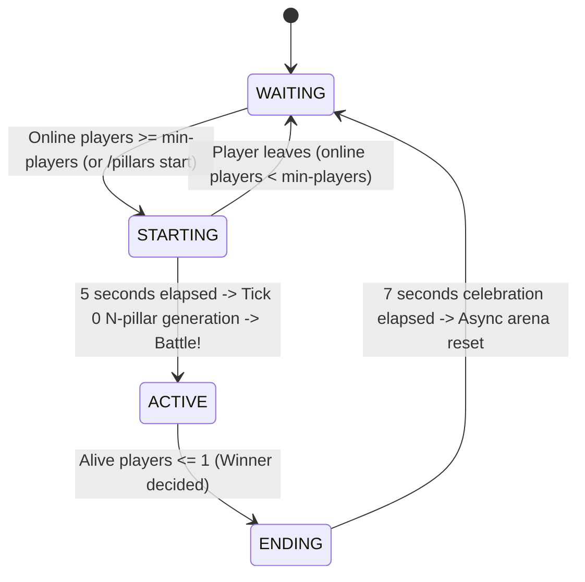

# Architecture Overview: Pillars of Fortune

This living document describes the high-level architecture, module topology, and core runtime flows of the **Pillars of Fortune** (`nadamu-pillar`) plugin.

---

## 1. Package Topology

```
space.nadamu.nadamupillar/
├── PillarsPlugin.java              # Bukkit plugin entrypoint and DI orchestrator
├── api/                            # Public domain events
│   └── PlayerEliminateEvent.java   # Dispatched on fatal damage / void fall
├── domain/                         # Core domain models
│   ├── GamePlayer.java             # Player wrapper, state, and statistics
│   └── PlayerRole.java             # Enum: ALIVE, SPECTATOR
├── registry/                       # In-memory thread-safe registries
│   └── PlayerRegistry.java         # Player session tracking by UUID
├── fsm/                            # Finite State Machine lifecycle
│   ├── GameState.java              # State interface with tick(), onEnter(), onExit()
│   ├── GameManager.java            # State orchestrator & transition coordinator
│   ├── WaitingState.java           # Lobby state (spectators hovering over void center)
│   ├── StartingState.java          # 5-second countdown with sound effects
│   ├── ActiveState.java            # Tick 0 generation, battle phase, loot & disasters
│   └── EndingState.java            # 7-second victory celebration on ruins before reset
├── arena/                          # Procedural arena builder and reset engine
│   ├── ArenaService.java           # Contract for arena generation and cleanup
│   ├── ProceduralArenaService.java # Mathematical circular N-pillar & center island builder
│   ├── BlockPatternParser.java     # Percentage-weighted block pattern parser
│   ├── MapManager.java             # Loader and validator of map configs
│   └── model/                      # Configuration domain models (MapConfig)
├── loot/                           # Loot distribution engine
│   ├── LootItem.java               # Weighted item representation with enchants
│   ├── WeightedLootTable.java      # Prefix-sum O(log N) binary search loot table
│   └── LootService.java            # Periodic item dispatch service
├── disaster/                       # Disaster engine
│   ├── Disaster.java               # Disaster contract
│   ├── DisasterContext.java        # Execution context (world, players, arena center)
│   ├── DisasterManager.java        # Disaster registration, filtering, and selection
│   ├── MeteorShowerDisaster.java   # Falling fireballs & ignited TNT
│   ├── AnvilRainDisaster.java      # Falling damaged and normal anvils
│   ├── GhastAssaultDisaster.java   # Hostile flying ghasts
│   ├── WindChargeStormDisaster.java# Wind charges launching players
│   └── LevitationWaveDisaster.java # Levitation & slow-falling wave
├── listener/                       # Event listeners (registered once in onEnable)
│   ├── VoidTrackingListener.java   # Intercepts fatal damage and void falls (< Y -10)
│   ├── PlayerConnectionListener.java # Handles join/quit, auto-registers players
│   └── GameProtectionListener.java # Enforces PvP/build rules based on current FSM state
├── command/                        # Administrative commands
│   └── PillarsCommand.java         # /pillars start|stop|status|forcenext + TabCompleter
└── scheduler/                      # Tick-based game loops
    └── ActionScheduler.java        # Periodic loot timer and disaster scheduling
```

---

## 2. FSM State Machine Lifecycle

The match flow is governed by a deterministic Finite State Machine (FSM):



### State Responsibilities:
1. **`WAITING`**:
   - All players are placed into `SPECTATOR` mode, freely hovering in the air over the center coordinate $(0, 100, 0)$.
   - PvP, block placing/breaking, and item interactions are strictly disabled.
2. **`STARTING`**:
   - 5-second countdown with action bar and sound effects (`BLOCK_NOTE_BLOCK_PLING`).
   - If player count falls below `min-players`, the countdown aborts cleanly back to `WAITING`.
3. **`ACTIVE`**:
   - **Tick 0**: Dynamic circular layout computes positions for exactly $N$ pillars ($N = \text{number of players}$).
   - Procedural generation builds pillars and the central island via FastAsyncWorldEdit (FAWE).
   - Players switch to `SURVIVAL`, receive initial items, and teleport asynchronously to their pillars.
   - Periodic loot distribution (every 10s) and random disasters (every 30s) begin.
4. **`ENDING`**:
   - Triggered when $\le 1$ player remains alive.
   - The winner is crowned with victory Titles and sound effects.
   - The battlefield is preserved for 7 seconds so players can celebrate on the ruins.
   - At the end of 7 seconds, FAWE asynchronously purges arena blocks and resets state to `WAITING`.

---

## 3. Architectural Invariants

1. **Single Void World**: All phases occur in a single default world (`world`). No multi-world loading, dimension unloading, or cross-world sync.
2. **Asynchronous Movement**: All player relocations use `player.teleportAsync(Location)`. Synchronous `player.teleport()` is forbidden.
3. **Entity Cleanup Safety**: Entity purging never removes players: `!(entity instanceof Player)`.
4. **Static Listeners**: Listeners are registered once in `PillarsPlugin#onEnable()`. Dynamic registration/unregistration inside state transitions is prohibited.
5. **Constructor Dependency Injection**: No static `getInstance()` singletons in domain models or FSM services.
